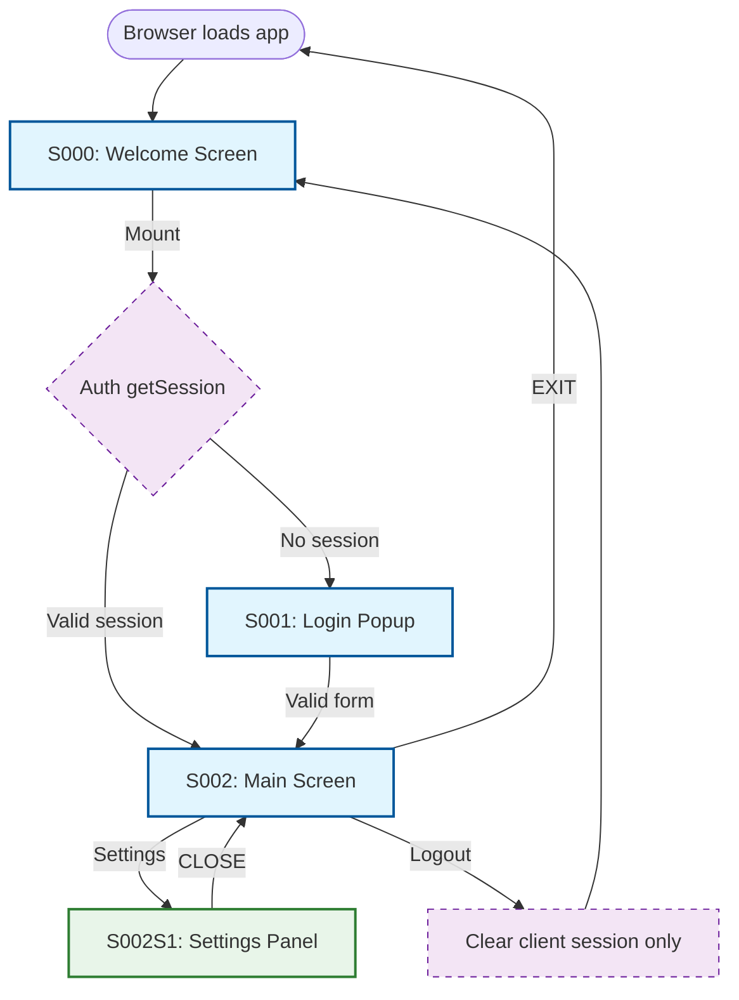
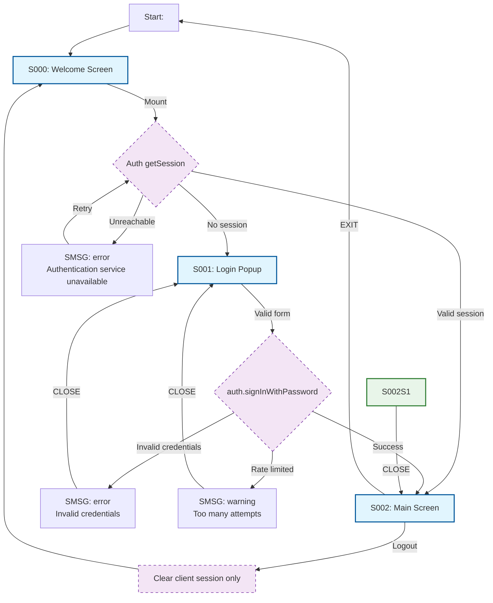
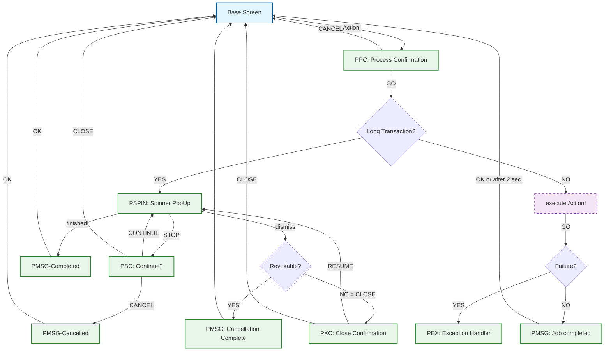

# NAVIGATION.md — AI Context: Core Navigation Button Rules

## Purpose of Document
This Context Files defines the minimal, unambiguous rule set for how AI shall vibecode standard buttons like [CANCEL], [CLOSE], [ESCape Keyboard event] and [X]) across all screen types and task states.  

> **Convention base:** Microsoft Windows / Fluent Design Guidelines.

---

## 1. Purpose of these Rules
Buttons with the same names - such as [CANCEL] or [CLOSE] shall trigger the same core functionality, subsequent navigation and restoration/manipulation of state accross all the application - as long as not specified otherwise. 

When a Standard Button from the list below is not further specified, the herein implied rules must be applied or the generator must stop and ask for clarifications before building!

The term "Standard Button" includes the ESCAPE-key and the [X] present in all screen in the top right corner. 

This helps consistency accross the application and avoids the repeated specification of these standard buttons. 

## 2. How these Rules shall be applied
NAVIGATION.md refiens SPEC.md and TECH.md in a sense, that it ensures, that their Standard Buttons and related Navigation comply with the herein specified naming conventions, functionality, navigation rules etc. 

This document advices generators to actively recommend adding Standard Buttons and Navigation when they are missing in SPEC.md or TECH.md. 

So, NAVIGATON.md is not really an AI context file on itself for vibecoding, but is used by AI to check the quality of SPEC.md and TECH.md which finally might overwrite the herein made rules. 

## 3. Naming Conventions
In all documentations all Standard Buttons shall be written within in brackets such as [CANCEL] so that it is clear that [CANCEL] means the Button rather than the "Cancel()" functionality.

All Standard Button Names are always in English - even when i8n is applied at a later stage. 

Standard Button-Names are always one-word in ALL-CAPITAL letters.   

Non Standard Buttons are in [] as well, but written in CamelCase and can be several words to be i8n-zed.


## 4. List of Standard Buttons

| Button | Definition | Promise |
|--------|-----------|---------|
| **[OK]** | Confirm Input | Verifys and confirms changed or inserte data and starts the screen's default behavior. |
| **[ENTER]** | Keyboard "OK" | Must behave identically to [OK] |
| **[CANCEL]** | Go back to last state | **Zero side effects.** The system always returns to the exact state before the current screen/modal opened. Changes will be lost. Running transactions are stopped. When restoration of last state is no longer or potentially not posssible use [CLOSE] instead. |
| **[CLOSE]** | Just close the screen | **Change and side effects remain and running transactions continue in a fire&forget mode.** Any work already applied or saved is preserved. |
| **[X]** | Title-bar close button in the top right corner. | Must behave identically to the screen's primary dismiss action (CLOSE or CANCEL). |
| **[ESC]** | Keyboard dismissal. | Must behave identically to the screen's primary dismiss action (CLOSE or CANCEL). |
| **[SAVE]** | Saves current Change | Only selectable when content was changed. Deactivate [SAVE] when changes are successfully saved (Deactivation tells the user that the changed content was successfully saved. When not successfully saved: display an error message with [RETRY] (Retrying the SAVE process) and [CLOSE] (returns to the changed Screen).  |
| **[STOP]** | Interrupt an in-flight background task. | **Side effects already exist.** The task is halted, but partial results might remain. Navigation remains on the current Screen that confirms the Stop in a MessagePopUp that informs about the current/stopped state (when possible) |
| **[CONTINUE]** | Continous a stopped task | **Side effects exist.** The task was halted and will continue (only display when continuation is possible and spinner is shown) |
| **[RETRY]** | Retry failed operation | Displays only on error-screens when an operation has failed besides [CANCEL] button. |
| **[EXIT]** | Like [ESC] followed by application EXIT | Displays a Confirmation Popup where user must confirm leaving the application without saving and without stopping already running transactions. When confirmed, behaves identically to the screen's primary dismiss action (CLOSE or CANCEL), does the same with ev. cascading parent screeens and when finally reaching the last screen, loggs the user out, frees all resources and finally closes the application. When the User [CLOSE]s the Confirmation Screen with confirming the "Exit()", the Confirmation Screen closes and returns to the last state.
| **[LOGOUT]** |Returns to Login | Behavior identical with EXIT with the difference that navigation returns to the Login-Screen in a state as if launched from scratch. Purpose is to login with a different user. |

Buttons with names OTHER than the ones listed above, must always be explicitely specified in SPEC.md and do not automatically comply with the herein enforced rules. 

[EXIT] and [LOGOUT] are normally not positioned on normal screens, but handled only as MenuOptions or at specific situation such as Application/System-Failure, Timeouts or non-responsive BackendActivity.  

---

## 5. Universal Rules (All Screens)

1. **Never use [CANCEL] and [CLOSE] interchangeably.** If the screen has already created side effects or still runs a non-revertible transaction, use [CLOSE]
However, when the screen can cleanly revert everything and can restore the previous state 100%, use [CANCEL].

2. **Every modal must contain an explicit safe action button** in the body. Never rely solely on the [X] title-bar button.

3. **ESC and [X] must always map to the same action** as the body's safe-dismiss button.

4. **Button Order must comply with Windows/Microsoft convention):** Primary/commit action on the **LEFT**, safe/dismiss action on the **RIGHT**.
   - Example: `[SAVE] [CANCEL]` or `[DELETE] [CANCEL]`  

5. **Never use generic [OK]** for destructive or committing actions. Use the verb: `[Send]`, `[Delete]`, `[Pay]`, `[Sign In]` instead. 

6. **If a background task (spinner) is running:**
   - If the task is **fully undoable** (no persistent state changed yet): use **[CANCEL]**.
   - If the task has **already created side effects** (partial download, temp files, state change): use **[STOP]** or **[CLOSE]**, not [CANCEL].
   - Never disable the **[STOP]**/**[CLOSE]** unless the operation is physically uncancelable for < 2 seconds.

---

## 6. Standard Screens
Primary Standard Screens host the applications primary functions. From here the real stuff is initiated and here is where control should always return. Other than the [Assisting Screens](#7-assisting-screens), Primary Screens are individual and therefore must be specified in more detail. 

Normally Standard Screens have rather a sequencial workflows that Starts with a Welcome Screen (S000) that calls an Authentication (PopUp) Screen (S001) which upon successful authenticatoin finally calls the MainScreen (S002) where the Settings (Scan be configures. 

---

## 6.1. Standard Screens Interaction Diagram



### 6.1 WELCOME Screen (S000: Modeless / Primary Window)
- **Dismiss action:** [CLOSE] only (Never use [CANCEL] on a main screen).  If unsaved work exists or transactions are still spinning, prompt to save before logging out the user, free all resources and closing the window/app. 
- **[X] title bar:** maps to [CLOSE]
- **[ESC] Keyboard:** maps to [CLOSE]

- **Button placement:** [X] in title bar is sufficient; no [CLOSE] button needed unless it's a panel.

### 6.2 AUTHENTICATION Screen (S001: Login / Sign-Up / MFA)
- **Dismiss action:** [CANCEL].
- **Rationale:** Authentication is a self-contained transaction. No side effects should exist until the final "Sign In" button is clicked and succeeds. Abandoning the flow must leave no partial session, temp tokens, or half-created accounts.
- **[X] title bar:** Maps to [CANCEL]. 
- **[ESC]:** Maps to CANCEL.
- **Buttons:** `[Sign In]` (primary, left), `[CANCEL]` (safe, right).
- **Exception:** If the auth screen is embedded as a panel in a main screen (modeless), use [CLOSE] instead.



### 6.3 MAIN Screen (S002)
- **Dismiss action -> [CLOSE]**: If unsaved work exists or transactions are still spinning, prompt to save before logging out the user, free all resources and closing the window/app. 
- **[X] title bar:** maps to [CLOSE]
- **[ESC] Keyboard:** maps to [CLOSE]

- **Button placement:** [X] in title bar is sufficient; [CLOSE] button only when explicitely requested by SPEC. 

### 6.4 SETTINGS Sub-Screen (S002S1)
**Purpose:** Allows authenticated users to manage their personal preferences. 

#### 6.4.1 Layout
```text
┌─────────────────────────────────────────┐
│    ┌───────────────────────────────┐    │
│    │                           [x] │    │
│    │ [S002S1] User Settings        │    │
│    │ Setting01: Value01            │    │
│    │ Setting02: Value02            │    │
|    |                               |    |
│    │ [ Cancel ] [ Save ]           │    │
│    └───────────────────────────────┘    │
└─────────────────────────────────────────┘
```
App specific Input Fields need to be added in the SPEC. 

#### 6.4.2 Elements

| Element | ID | Type | Label / Placeholder | Validation / Constraints |
|---------|-----|------|---------------------|--------------------------|
| Screen Badge | `s002s1-badge` | Div | — | Fixed top-left of popup, text: `S002S1` |
| Title | `s002s1-title` | H3 | "User Settings" | — |
| [CANCEL] | `s002s1-cancel` | Button | "Cancel" | Secondary style. Closes popup immediately. Discards unsaved changes. |
| [SAVE] | `s002s1-save` | Button | "Save" | Primary style. Disabled until at least one field is modified and all fields are valid. Shows spinner during persistence. |

App specific Input Fields need to be added in the SPEC. 

#### 6.4.3 Behavior

| Event | Action |
|-------|--------|
| **Popup Open** | Read `UserSettings`; pre-fill inputs (or empty when never set). Focus  first input field; track dirty state per field. |
| **Save Click** | 1. Validate fields. 2. Disable button and show spinner. 3. Save the data to permanent storage 4. On success update Zustand `ui` state, close popup, and show success. 5. On failure show SMSG. |
| **Cancel / Escape / [x] Click** | Discard changes and return to Base Screen; if dirty, show the required confirmation SMSG first. |

App specific Behavor needs to be added in the SPEC. 

#### 6.4.4 Standard Error Handling

| Error | SMSG Type | Message |
|-------|-----------|---------|
| Settings save failed | `error` | "Failed to save settings. Please try again." |
| Network timeout | `warning` | "Connection timed out. Please try again." |

App specific Error Message need to be added in the SPEC. 

## 7. Standard Dialoge PopUps
Standard Dialoge PopUps guide users when interacting with the application, through transactions and when navigating from screen to screen making sure the user understands  what he or she is doing. Assisting Screens follow normally standard procedures and share the same design. 

It is an architectural goal to reduse the amount of assisting screens to a few types that just display different messages and might start different actions but otherwise look and behavie identical. 

Assisting Screens are normally implemented as Modal Dialogue Screens, in the following called PopUps that will overlay the Base Screen till their Message or Mission is completed.  

Assisting Screen-names will all start with a "P" for Popup and will also referred to as "PopUps" in contrast to primary "Screens" that alwys will start with an "S" like "S000" for the Welcome Screen.

### 7.1. Standard PopUps Interaction Diagram
The following Diagram is generic and starts from a so called Base-Screen (either a Standard or Individual primary Screen) where Standard PropUp's control is normally given back to when the PopUp's mission is completed. 


    
### 7.2 PPC: PROCESS CONFIRMATION PopUp
Process Confirmation PopUps (PPC) **confirm the start of a critical or long lasting transaction** (e.g. loading a file, calling a remote service) or before the application0s state is changed (Logout, Exit, Discard all Changes, Aborting a transaction).

PPCs are not aware of anytransactions, have zero impact on the state and will always just return to the Base Screen with an info about which button [GO] or [CANCEL] was pressed.  
 
#### Message Text
Short description what is going to happen next such as "Loading File", "Booking your Flight" and therefore its execution must be confirmed by the user with [GO] or wether the execution is revoked with [CANCEL].  

#### Buttons 
PPCs always only have [GO] and [CANCEL]: 

1. **[GO]**: Signals process confirmation

2. **[CANCEL]**. Revert all selections, closes modal, returns to previous state without side-effects.
  
* **[ X ] title bar and [ESC]** are mapped to [CANCEL].

Whatever button is clicked the modal closes and control goes back to the Base Screen with a message about which Button was clicked. Its up to the Base to define and execute the subsequent processings with or without a Spinenr Popup

### 7.3 PSPIN: Spinner PopUp
Spinner PopUps are displayed during previously condfirmed, long lasting transactions and normally will display a spinner icon and a progress bar that illustrate an ongoing transaction with its current progress and state. 

The Spinner PopUp provides just the GUI with a test and button to STOP or CANCEL/CLOSE the process. 

Dismiss buttons depend on the transaction's progress status and its revertability / revokability

1. Display **[CANCEL]** when the transaction did not start yet or when it can be easily revoked without Side Effects. Revoke the transaction, close the modal and return to previous state.
  
2. Display **[CLOSE]** and **[STOP]** **when the transactions is spinning** and either cannot be fully revoked or has side-effects: 

    * **[STOP]** stops the process and opens a Stop Transaction PopUp that informs about the Stopped State and will ask for [CONTINUE] to resume the stopped process or to [CLOSE] it. Continue() and Close() is always handled by this panel, not the PopUp.    

    * **[CLOSE]** leaves the transaction inattended in a fire&forget mode, closes the modal and returns to the parent screen.
    
* **[ X ] title bar and [ESC]**: Map to the current dismiss action ([CANCEL] or [CLOSE]). Neither [X] nor [ESC] will ever [STOP]

### 7.4 PSC: Process STOP Dialogue PopUp
Process Stop Dialogue PopUps (PSD) wants to know whether the previously stopped transaction shall Continue or be dismissed. 
 
#### Message Text
The message text just inform the user about the side-effects an aborted transactoin might have, such as not being informed about the final transaction status (success or fail), effective duration and whether it has ever finished or still blocking resources.   

#### Buttons 
PXCs only have [CONTINUE] and either [CLOSE] or [CANCEL] depending on whether the transaction can be cancelled with out side-effexts (CANCEL) or not (CLOSE). 

1. **[CANCEL]**: Only when the Transaction can be successfullly cancelled without side effects. Then the PopUp is closed and control goes **back to the BaseScreen** to cancel the Transaction and confirm the cancellation with a PMSG .  

2. **[CLOSE]**: the PopUp is closed and control goes **back to the BaseScreen** whereas the transaction continues unattended (but eventually logged) in the background. 

3. **[CONTINUE]**: Goes Back to the Spinner-PopUP where the Transaction resumes.
  
* **[X] in the title bar and [ESC]** are mapped to  [CLOSE] or [CANCEL] depending on whether the transaction can be cancelled with out side-effexts (CANCEL) or not (CLOSE). 

Whatever button is clicked the modal closes and control goes back to the Base Screen with a message about which button was clicked. Its up to the BaseScreen to define and execute the subsequent processings for cancelling the transaction with a cancellation confirmation PMSG or to display the Spinner Popup (PSPIN) again to proceed with the newest status.

### 7.5 PXC: Process CLOSING Confirmation PopUp
Process Closing Confirmation PopUps (PXC) wants a **confirmation for abandaoning an onging, non revokable transaction** with side effects (e.g. writing a file, waiting for a server response) whose output will, after the closing, just be ignored. Closing is forgetting about the running transaction.
 
#### Message Text
The message text just inform the user about the side-effects the ongoing transaction might have, such as not being informed about the final transaction status (success or fail), effective duration and whether it has ever finished or still blocking resources.   

#### Buttons 
PXCs only have [CLOSE] and [RESUME]: 

1. **[CLOSE]**: the PopUp closed and control goes **back to the BaseScreen**. The transaction continues unattended (but eventually logged) in the background. 

2. **[RESUME]**: Goes Back to the Spinner-PopUP where the Transaction resumes.
  
* **[X] in the title bar and [ESC]** are mapped to [RESUME].

Whatever button is clicked the modal closes and control goes back to the Base Screen with a message about which Button was clicked. Its up to the BaseScreen to define and execute the subsequent processings for cancelling the transaction with a Cancellation confirmation PMSG or to display the Spinner Popup (PSPIN) again to proceed with the newest status.

### 6.5 Stop Transaction PopUp (SSTP): Modal Dialog
This Popup is called from a Processing Status PopUp when its [STOP] or [CLOSE] button is clicked to stop an ongoing transaction. It informs about the Stopped State such as how many files of how many total were alreay written. 

With the [CONTINUE]-button the modal is closed and the parent tries to to resume the stopped process. 

With [CLOSE] thwill try to cancel the process, and when not possible let it continue in a fire&forget mode that finally releases resources and memory again. 

### 6.6 PMSG General Message PopUp
**Purpose:** Universal feedback component for errors, warnings, success, and info messages that only requires a simple confirmation for being notices (by clicking [OK]).

This PopUp therefore is fully passive and has never side effects. Never other buttons besides [OK] and [X]: Just closing the PopUp and giving back the control to the underlying parent screen.   

#### 6.6.1 Layout
```
┌─────────────────────────────────────────┐
│                                    [X]  │
│    ┌───────────────────────────────┐    │
│    │  [ICON]  Title                │    │
│    │          Message body text    │    │
│    │          goes here.           │    │
│    │                               │    │
│    │          [  OK  ]             │    │
│    └───────────────────────────────┘    │
│                                         │
└─────────────────────────────────────────┘
```

#### 6.6.2 Elements

| Element | ID | Type | Description |
|---------|-----|------|-------------|
| Overlay | `smsg-overlay` | Div | `position: fixed; inset: 0; background: rgba(0,0,0,0.5); z-index: 10000` |
| Modal Card | `smsg-card` | Div | Centered, 400px max-width, white bg, 12px radius, shadow-lg |
| Icon | `smsg-icon` | SVG | 24×24px. Color matches type. |
| Title | `smsg-title` | H3 | Bold, 18px. Content depends on type. |
| Message | `smsg-message` | P | 16px, `--text-primary`. Max 3 lines. |
| Action Button | `smsg-action` | Button | Primary style. Label: "OK" or custom CTA. |
| Close (X) | `smsg-close` | Button | Top-right corner. `aria-label="Close message"` |

#### 6.6.3 Message Types & Icons

| Type | Icon | Title Default | Icon Color | Use Case |
|------|------|---------------|------------|----------|
| `error` | ❌ Circle-X (Lucide) | "Error" | `--error` | Auth failures, 5xx errors, validation blockers |
| `warning` | ⚠️ Triangle-alert (Lucide) | "Warning" | `--warning` | Rate limits, unsaved changes, partial failures, destructive action confirmations |
| `success` | ✅ Circle-check (Lucide) | "Success" | `--success` | Login success, export success, import success |
| `info` | ℹ️ Circle-info (Lucide) | "Information" | `--info` | Tips, draft loaded, feature announcements |

#### 6.6.4 Behavior

| Rule | Specification |
|------|---------------|
| **Stacking** | Only one SMSG visible at a time. New message replaces existing. |
| **Auto-dismiss** | `success` and `info` auto-dismiss after 5 seconds. `error` and `warning` require manual dismissal. Exception: `warning` used as confirmation dialog (EXIT, LOGOUT, CANCEL, destructive actions) is persistent. |
| **Focus** | On open, focus moves to `smsg-action` button. Focus trap active. |
| **[ESC]** | Pressing Escape dismisses the popup (except for critical errors and confirmation dialogs for EXIT, LOGOUT, CANCEL, and dirty-form warnings that block flow). |
| **Animation** | Enter: fade in 200ms + scale from 0.95. Exit: fade out 150ms. |
| **Accessibility** | `role="alertdialog"`, `aria-modal="true"`, `aria-labelledby="smsg-title"`. |
| **[X]** | Clicking [X] or tying Escape maps to [ESC] |

#### 6.6.5 API (Programmatic Trigger)

```typescript
interface ShowMessageParams {
  type: 'error' | 'warning' | 'success' | 'info';
  title?: string;        // Optional. Uses default if omitted.
  message: string;       // Required. Max 200 chars.
  actionLabel?: string;  // Default: "OK"
  onAction?: () => void; // Callback on button click
  persistent?: boolean;  // If true, no auto-dismiss, no Escape close
}

showMessage(params: ShowMessageParams): void;
```


---

## 7. Background Task Rules (Spinner Active)

| State | Dismiss Button | [X] / ESC Behavior | Rationale |
|-------|---------------|-------------------|-----------|
| **Spinner running, task undoable** | **CANCEL** | Triggers CANCEL | Task can be aborted and be restarted with zero residue (e.g., in-memory search, uncommitted form validation). |
| **Spinner running, with side effects** | **STOP** | Triggers STOP | Task has already written state (e.g., partial file download, DB write, API call made with progression feedback). -> opens Popup asking for [CONTINUE] vs. [CLOSE] |
| **Spinner running, awaits completion notice** | **CLOSE** | Triggers CLOSE | Task cannot be stopped and will either complete or fail |
| **Spinner finished, result shown** | **[CLOSE]** | Triggers CLOSE | The task is done; the user is merely dismissing the completion notice. |

- **Never show [CANCEL] on a completion/success screen.** Use [CLOSE] instead.

- **If [STOP] is used,** the UI must clearly display what was already completed (e.g., "3 of 5 files loaded").

---

## 8. Quick Decision Matrix

| Screen Type                     | Side Effects?      | Spinner? | Use    | [X]/ESC |
|---------------------------------|--------------------|----------|--------|---------|
| Main Screen                     | Yes / No           | No       | CLOSE  | CLOSE   |
| Auth Screen                     | No (until success) | No       | CANCEL | CANCEL  |
| Confirmation (pre-commit)       | No                 | No       | CANCEL | CANCEL  |
| Confirmation (post-commit)      | Yes                | No       | CLOSE  | CLOSE   |
| Task in progress (undoable)     | No                 | Yes      | CANCEL | CANCEL  |
| Task in progress (side effects) | Yes                | Yes      | STOP   | STOP    |
| Task complete / Result          | Yes                | No       | CLOSE  | CLOSE   |

---

## 9. Naming Conventions for AI Vibe-Coding

- Use `onCancel()` only when the handler truly reverts state.
- Use `onClose()` only when the handler dismisses without reverting.
- Use `onStop()` only for interrupting background tasks with side effects.
- Map `onEscapeKey()` and `onTitleBarClose()` to the appropriate handler above — never implement custom logic directly in those handlers.
