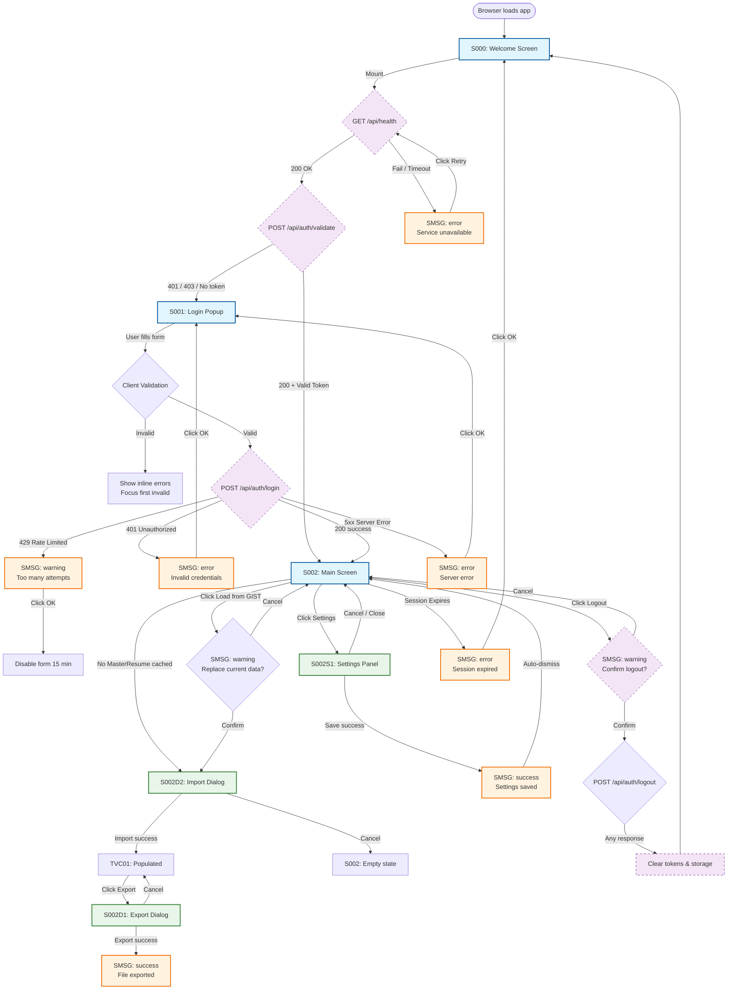

# `spec.md` — Applai Resume Generator

**Version:** 1.0.3
**Date:** 2026-08-15
**Status:** Ready for VibeCoding
**Scope:** Authentication Flow (S000 → S001 → S002) + Global Messaging (SMSG) + Import/Export Dialogues (S002D1, S002D2) + Settings Panel (S002S1)

---

## 1. Architecture & Security Baseline

| Layer | Requirement |
|-------|-------------|
| **Transport** | HTTPS/TLS 1.3 mandatory. HSTS header with `max-age=31536000; includeSubDomains; preload`. |
| **Session** | Stateless JWT access token (15 min TTL) + httpOnly, Secure, SameSite=Strict refresh token cookie (7 days). |
| **Passwords** | Argon2id hashing on server. Client-side: min 12 chars, 1 upper, 1 lower, 1 digit, 1 special. |
| **Rate Limiting** | 5 attempts / 15 min / IP per endpoint. After 3 failures: CAPTCHA (hCaptcha v2 invisible) required. After 5 failures: 15-min lockout. |
| **CSRF** | Double-submit cookie pattern for non-GET requests. |
| **CSP** | `default-src 'self'; script-src 'self'; style-src 'self'; connect-src 'self' /api;` |
| **Headers** | `X-Content-Type-Options: nosniff`, `X-Frame-Options: DENY`, `Referrer-Policy: strict-origin-when-cross-origin` |
| **Input Sanitization** | DOMPurify on all user inputs before DOM insertion. Regex whitelist validation on all fields. |
| **Auto-Redirect** | If valid refresh token exists and `/api/auth/validate` returns 200, skip S000/S001 and route directly to S002. |

---

## 2. Global Design System

### 2.1 Screen Number Badge
- **Position:** Fixed, top-left corner, `z-index: 9999`.
- **Style:** 8px × 8px rounded pill, `background: rgba(0,0,0,0.6)`, `color: #fff`, `font: 10px monospace`, `padding: 2px 6px`.
- **Content:** Exact screen number (e.g., `S000`, `S001`, `S002`, `SMSG`, `S002D1`, `S002D2`, `S002S1`).
- **Behavior:** Non-interactive, does not block clicks, always visible.

### 2.2 Color Palette
| Token | Hex | Usage |
|-------|-----|-------|
| `--primary` | `#0F172A` | Headings, primary buttons |
| `--accent` | `#3B82F6` | Links, focus rings, active states |
| `--success` | `#10B981` | Valid input borders, success messages |
| `--warning` | `#F59E0B` | Warning messages |
| `--error` | `#EF4444` | Error states, error messages |
| `--info` | `#6366F1` | Info messages |
| `--surface` | `#FFFFFF` | Card backgrounds |
| `--bg` | `#F8FAFC` | Page backgrounds |
| `--text-primary` | `#1E293B` | Body text |
| `--text-secondary` | `#64748B` | Labels, placeholders |

### 2.3 Typography
- **Font Family:** `Inter, system-ui, -apple-system, sans-serif`
- **Headings:** 600 weight
- **Body:** 400 weight, 16px base
- **Labels:** 500 weight, 14px, `--text-secondary`

### 2.4 Spacing & Layout
- **Max Content Width:** 480px for auth screens, 1200px for S002.
- **Padding Scale:** 4px, 8px, 16px, 24px, 32px, 48px.
- **Border Radius:** 8px (inputs), 12px (cards), 24px (buttons).
- **Shadows:** `0 1px 3px rgba(0,0,0,0.1)` (cards), `0 4px 6px rgba(0,0,0,0.1)` (modals).

---

## 3. Screen Specifications

---

### 3.1 S000 — Welcome Screen / Landing Page

**Purpose:** First point of contact. Displays branding, checks auth service health, and conditionally renders the login popup.

#### 3.1.1 Layout
```
┌─────────────────────────────────────────┐
│ [S000]                                  │
│                                         │
│         ┌─────────────────────┐         │
│         │   [App Logo]        │         │
│         │   Applai Resume     │         │
│         │   Generator         │         │
│         │                     │         │
│         │   Welcome message   │         │
│         │   ───────────────── │         │
│         │   [S001 Login Popup │         │
│         │    OR spinner]      │         │
│         └─────────────────────┘         │
│                                         │
│         [Footer links]                  │
└─────────────────────────────────────────┘
```

#### 3.1.2 Elements

| Element | ID | Type | Description |
|---------|-----|------|-------------|
| App Logo | `s000-logo` | SVG | 64×64px, primary color, `aria-label="Applai Resume Generator Logo"` |
| App Name | `s000-title` | H1 | Text: **"Applai Resume Generator"** |
| Welcome Message | `s000-welcome` | P | Text: *"Create professional resumes powered by AI."* |
| Health Status Spinner | `s000-spinner` | Div | Centered, 32px CSS spinner, `aria-live="polite"`, visible only during `/api/health` call |
| Login Container | `s000-login-container` | Div | Mount point for S001. Hidden until health check passes. |
| Footer | `s000-footer` | Footer | Links: Privacy Policy, Terms of Service, Contact Support |

#### 3.1.3 Behavior & Logic

1. **On Mount:**
   - Display spinner.
   - Fire `GET /api/health` with 5s timeout.
   - If `200 OK` → hide spinner, fade in S001 login popup centered in `s000-login-container`.
   - If `4xx/5xx/timeout` → hide spinner, show SMSG with `type: error`, message: *"Authentication service is unavailable. Please try again later."* CTA button: **"Retry"** (re-fires health check).

2. **Returning User Check (Parallel to Health Check):**
   - Fire `POST /api/auth/validate` with refresh token cookie.
   - If `200 OK` → immediately route to S002 (bypass S001 entirely).
   - If `401/403` → continue to S001 (normal flow).

3. **Background:**
   - Subtle gradient: `linear-gradient(135deg, #F8FAFC 0%, #E2E8F0 100%)`.
   - No animation that delays interaction.

---

### 3.2 S001 — Login Screen (Popup)

**Purpose:** Collect credentials, authenticate user, handle errors, support password recovery.

**Container:** Centered modal card inside S000. Overlay: `rgba(15, 23, 42, 0.4)` with `backdrop-filter: blur(4px)`.

#### 3.2.1 Layout
```
┌─────────────────────────────────────────┐
│ [S000]                                  │
│                                         │
│    ┌───────────────────────────────┐    │
│    │         [S001]                │    │
│    │  ┌─────────────────────────┐  │    │
│    │  │    Applai Resume      │  │    │
│    │  │    Generator          │  │    │
│    │  │                         │  │    │
│    │  │  Email                 │  │    │
│    │  │  ┌───────────────────┐ │  │    │
│    │  │  │                   │ │  │    │
│    │  │  └───────────────────┘ │  │    │
│    │  │  Password              │  │    │
│    │  │  ┌───────────────────┐ │  │    │
│    │  │  │              [👁] │ │  │    │
│    │  │  └───────────────────┘ │  │    │
│    │  │  [ ] Remember me       │  │    │
│    │  │                         │  │    │
│    │  │  [    Sign In    ]     │  │    │
│    │  │                         │  │    │
│    │  │  Forgot password?      │  │    │
│    │  └─────────────────────────┘  │    │
│    └───────────────────────────────┘    │
│                                         │
└─────────────────────────────────────────┘
```

#### 3.2.2 Elements

| Element | ID | Type | Label / Placeholder | Validation Rules |
|---------|-----|------|---------------------|------------------|
| Screen Badge | `s001-badge` | Div | — | Fixed top-left, text: `S001` |
| Card Title | `s001-title` | H2 | "Sign in to your account" | — |
| Email Label | `s001-email-label` | Label | "Email address" | — |
| Email Input | `s001-email` | Email | `placeholder="you@company.com"` | Required. Regex: `^[a-zA-Z0-9._%+-]+@[a-zA-Z0-9.-]+\.[a-zA-Z]{2,}$`. Max 254 chars. Trim whitespace on blur. |
| Email Error | `s001-email-error` | Span | Inline error text | Hidden by default. Shows: *"Please enter a valid email address."* |
| Password Label | `s001-password-label` | Label | "Password" | — |
| Password Input | `s001-password` | Password | `placeholder="Enter your password"` | Required. Min 12 chars. Max 128 chars. |
| Password Toggle | `s001-toggle-password` | Button | `aria-label="Show password"` | Icon: Eye (show) / EyeOff (hide). Toggles input `type`. |
| Password Error | `s001-password-error` | Span | Inline error text | Hidden by default. Shows: *"Password must be at least 12 characters."* |
| Remember Me | `s001-remember` | Checkbox | Label: "Remember me for 7 days" | Default: **unchecked**. If checked, refresh token TTL extends to 30 days. |
| Sign In Button | `s001-submit` | Button | "Sign In" | Primary style. Disabled state during API call. Shows spinner inside button during loading. |
| Exit Button | `s001-exit` | Button | "EXIT" | Secondary style. Closes the entire application after confirmation. No pending transactions are waited for. |
| Forgot Password | `s001-forgot` | Link | "Forgot password?" | Text link, accent color. Opens password reset flow (SMSG info: *"Check your email for reset instructions."*) |
| CAPTCHA Container | `s001-captcha` | Div | — | Invisible until triggered by rate limit. |

#### 3.2.3 Interaction & Validation Rules

| Event | Action |
|-------|--------|
| **Email Blur** | Validate regex. If invalid, show `s001-email-error`, set `aria-invalid="true"`, add red border. |
| **Password Blur** | Validate length. If invalid, show `s001-password-error`. |
| **Form Submit** | 1. Prevent default. 2. Validate all fields. 3. If invalid, focus first invalid field. 4. If valid, disable submit, show spinner. 5. If CAPTCHA required, execute hCaptcha first. 6. Fire `POST /api/auth/login` with `{email, password, captchaToken}`. |
| **Login Success (200)** | Store JWT in `memory` (never localStorage). Set refresh cookie (httpOnly, Secure, SameSite=Strict). Route to S002. |
| **Login Failure (401)** | Show SMSG `type: error`, message: *"Invalid email or password."* Clear password field. Focus password. Increment attempt counter. |
| **Login Failure (429)** | Show SMSG `type: warning`, message: *"Too many attempts. Please try again in 15 minutes."* Disable form for 15 min. |
| **Login Failure (5xx)** | Show SMSG `type: error`, message: *"Something went wrong. Please try again."* |
| **Enter Key** | Triggers form submit from any input. |
| **Escape Key** | Does nothing (modal is not dismissible; login is mandatory). |
| **EXIT Click** | Show SMSG `type: warning`, persistent: *"Are you sure you want to exit?"* — on confirm, close the application immediately (`window.close()` or navigate to `about:blank`). No pending transactions are waited for. On cancel, return to S001. |

#### 3.2.4 Accessibility
- All inputs have associated `<label>` with `for` attribute.
- Error messages linked via `aria-describedby`.
- Focus trap inside modal.
- Initial focus on email input on mount.
- Color contrast ratio ≥ 4.5:1 for all text.

---

### 3.3 S002 — Main Screen

**Purpose:** Core application interface for managing and exporting resume data from a GIST-loaded MasterResume.JSON file. Only accessible post-authentication.

#### 3.3.1 Layout
```
┌─────────────────────────────────────────────────────────────┐
│ [S002]  Applai Resume Generator    [EXIT] [LOGOUT] [CANCEL] │
├─────────────────────────────────────────────────────────────┤
│                                                             │
│  [Load from GIST]  [Display All: ●OFF]  [Export]           │
│                                                             │
│  ┌─────────────────────────────────────────────────────┐   │
│  │  TVC01 — TreeView Component                         │   │
│  │                                                     │   │
│  │  [x] Experiences                                    │   │
│  │   |   +-[x] "2002-2004" "Company01" "My First Job"  │   │
│  │   |   | "Detailed JobDescripton for Job01..."       │   │
│  │   |   +-[ ] "2004-2009" "Company02" "My Second Job" │   │
│  │   |      "Detailed JobDescripton for Job02..."      │   │
│  │  [x] Skills                                         │   │
│  │       +-[x] "VibeCoding" *****                      │   │
│  │       +-[ ] "C#" *****                              │   │
│  │                                                     │   │
│  └─────────────────────────────────────────────────────┘   │
│                                                             │
└─────────────────────────────────────────────────────────────┘
```

#### 3.3.2 Elements

| Element | ID | Type | Description |
|---------|-----|------|-------------|
| Screen Badge | `s002-badge` | Div | Fixed top-left, text: `S002` |
| Header Title | `s002-header-title` | Span | "Applai Resume Generator" |
| Exit Button | `s002-exit` | Button | "EXIT" | Closes the entire application immediately after confirmation. No pending transactions are waited for. Also available in S001. |
| Logout Button | `s002-logout` | Button | "LOGOUT" | Returns to S000 Welcome Screen / S001 Login Popup after confirmation. Clears JWT from memory. No pending transactions are waited for. User must login again or exit. |
| Cancel Button | `s002-cancel` | Button | "CANCEL" | Cancels running transactions (stops spinner, aborts in-flight requests) after confirmation. If no transactions are running, resets all TVC01 nodes to `selected: true` and discards any text modifications. |
| Load from GIST Button | `s002-load-gist` | Button | "Load from GIST" | Triggers import flow. If TVC01 already contains data, SMSG `type: warning` prompts: *"Loading a new MasterResume will replace current data. Continue?"* — user must confirm before S002D2 opens. |
| Display All Toggle | `s002-display-all` | Toggle Button | "Display All" | OFF by default. When OFF, deselected nodes (and children) are hidden. When ON, all nodes visible regardless of selection state. |
| Export Button | `s002-export` | Button | "Export" | Opens S002D1 Export Dialogue PopUp. |
| Settings Button | `s002-settings` | Button | "Settings" | Opens S002S1 Settings Panel PopUp. |
| TreeView Container | `s002-tvc01-container` | Div | Mount point for TVC01 component. |

#### 3.3.3 TVC01 — TreeView Component

**Purpose:** Display loaded MasterResume.JSON content as selectable, collapsible, editable nodes.

**Behavior:**
- **Selection:** All tree-nodes have a checkbox. Checked = selected, unchecked = deselected. Clicking the checkbox toggles selection state.
- **Collapse/Expand:** Double-clicking any node row toggles collapse/expand state of its children.
- **Display:** When `s002-display-all` is OFF, deselected nodes and their child nodes are hidden from view. When ON, all nodes are visible regardless of selection.
- **Editing:** Each node has an editable info-field associated with JSON entries.
- **Visual Structure:** Tree indentation indicates hierarchy. Selected state persists per node.

**Example Structure:**
```plaintext
[x] Experiences
 |   +-[x] "2002-2004" "Company01" "My First Job" 
 |   | "Detailed JobDescripton for Job01 on several lines" 
 |   +-[ ] "2004-2009" "Company02" "My Second Job" 
 |      "Detailed JobDescripton for Job02 on several lines" 
[x] Skills
     +-[x] "VibeCoding" *****
     +-[ ] "C#" *****
```

#### 3.3.4 [Display All] Button

| State | Behavior |
|-------|----------|
| **OFF (default)** | TVC01 hides all deselected nodes and their children. Only selected nodes and their selected ancestors are visible. |
| **ON** | TVC01 displays all nodes regardless of selection state. Checkboxes remain interactive. |

**Toggle Visual:** Sliding toggle or button with clear ON/OFF state indicator.

#### 3.3.5 [Export] Button

**Trigger:** Click `s002-export`.

**Action:** Open S002D1 Export Dialogue PopUp.

**Backend Logic (post-dialogue):**
- Generate a JSON file containing only selected nodes and branches from the current TVC01 state.
- The exported file has the same structure as MasterResume.JSON but is a subset (deselected nodes excluded).
- Save to GIST with the filename determined in S002D1.

---

### 3.4 S002D1 — Export Dialogue PopUp

**Purpose:** Collect filename for exported CV JSON.

**Container:** Modal popup consistent with SMSG design system (same overlay, card styling, shadows, animations).

#### 3.4.1 Layout
```
┌─────────────────────────────────────────┐
│                                         │
│    ┌───────────────────────────────┐    │
│    │  [S002D1]                     │    │
│    │                               │    │
│    │  Export Your CV               │    │
│    │                               │    │
│    │  Please enter a qualified     │    │
│    │  name for your exported CV.   │    │
│    │                               │    │
│    │  CV Name                      │    │
│    │  ┌─────────────────────────┐  │    │
│    │  │  GeneratedCV            │  │    │
│    │  └─────────────────────────┘  │    │
│    │                               │    │
│    │  [  Cancel  ]  [  Export  ]   │    │
│    │                               │    │
│    └───────────────────────────────┘    │
│                                         │
└─────────────────────────────────────────┘
```

#### 3.4.2 Elements

| Element | ID | Type | Label / Placeholder | Validation / Constraints |
|---------|-----|------|---------------------|--------------------------|
| Screen Badge | `s002d1-badge` | Div | — | Fixed top-left of popup, text: `S002D1` |
| Title | `s002d1-title` | H3 | "Export Your CV" | — |
| Prompt Message | `s002d1-prompt` | P | "Please enter a qualified name for your exported CV." | — |
| CV Name Label | `s002d1-name-label` | Label | "CV Name" | — |
| CV Name Input | `s002d1-name` | Text | `placeholder="GeneratedCV"` | Required. Min 3 chars, max 23 chars. Regex: `^[a-zA-Z0-9_-]{3,23}$`. Only regular characters, numbers, hyphen, and underscore allowed. |
| Name Error | `s002d1-name-error` | Span | Inline error | Hidden by default. Shows: *"Name must be 3–23 characters. Only letters, numbers, hyphens, and underscores allowed."* |
| Cancel Button | `s002d1-cancel` | Button | "Cancel" | Secondary style. Closes popup immediately. Cancels any running export transaction. No side effects. |
| Export Button | `s002d1-export` | Button | "Export" | Primary style. Disabled until input valid. Triggers export save. |

#### 3.4.3 Behavior

| Event | Action |
|-------|--------|
| **Popup Open** | Pre-fill input with default value `GeneratedCV`. Focus input, select all text. |
| **Input Blur** | Validate regex and length. Show inline error if invalid. |
| **Export Click** | 1. Validate input. 2. If invalid, show error and focus field. 3. If valid, close popup. 4. Generate subset JSON from TVC01 selected nodes. 5. Check GIST for existing files matching `GeneratedCV*.JSON`. 6. If `GeneratedCV.JSON` exists, increment two-digit suffix: `GeneratedCV01.JSON`, `GeneratedCV02.JSON`, etc. 7. Save to GIST. 8. Show SMSG `type: success`: *"CV exported successfully as [filename]."* |
| **Cancel Click** | Close popup immediately. Abort any in-flight export request. Return to S002. |
| **Escape Key** | Same as Cancel. |
| **Overlay Click** | Same as Cancel. |

#### 3.4.4 Filename Generation Rules
- Base name: User input from `s002d1-name` (default: `GeneratedCV`).
- Extension: `.JSON` (uppercase).
- Collision handling: If `[name].JSON` exists in GIST, append two-digit counter starting at `01`: `[name]01.JSON`, `[name]02.JSON`, up to `99`.
- If all 100 variants exist, show SMSG `type: error`: *"Export failed: too many files with this name. Please choose a different name."*

---

### 3.5 S002D2 — GIST MasterResume IMPORT Dialogue PopUp

**Purpose:** Collect the GIST URL and filename to load a new MasterResume.JSON from a GIST. Triggered by the `s002-load-gist` button on S002, or automatically on S002 mount when no MasterResume data is present.

**Container:** Modal popup consistent with SMSG design system (same overlay, card styling, shadows, animations).

#### 3.5.1 Layout
```
┌─────────────────────────────────────────┐
│                                         │
│    ┌───────────────────────────────┐    │
│    │  [S002D2]                     │    │
│    │                               │    │
│    │  Import Master CV             │    │
│    │                               │    │
│    │  Please enter the URL of your │    │
│    │  Gist and choose your Master- │    │
│    │  Resume file                  │    │
│    │                               │    │
│    │  GIST URL:                    │    │
│    │  ┌─────────────────────────┐  │    │
│    │  │  https://gist.github... │  │    │
│    │  └─────────────────────────┘  │    │
│    │                               │    │
│    │  MasterResume File Name:      │    │
│    │  ┌─────────────────────────┐  │    │
│    │  │  MasterResume.json      │  │    │
│    │  └─────────────────────────┘  │    │
│    │                               │    │
│    │  [  Cancel  ]  [  Import  ]   │    │
│    │                               │    │
│    └───────────────────────────────┘    │
│                                         │
└─────────────────────────────────────────┘
```

#### 3.5.2 Elements

| Element | ID | Type | Label / Placeholder | Validation / Constraints |
|---------|-----|------|---------------------|--------------------------|
| Screen Badge | `s002d2-badge` | Div | — | Fixed top-left of popup, text: `S002D2` |
| Title | `s002d2-title` | H3 | "Import Master CV" | — |
| Prompt Message | `s002d2-prompt` | P | "Please enter the GIST URL and then choose a file for import." | — |
| GIST URL Label | `s002d2-url-label` | Label | "GIST URL" | — |
| GIST URL Input | `s002d2-url` | URL | `placeholder="https://gist.github.com/..."` | Required. Must be valid HTTPS URL. Max 500 chars. Regex: `^https://[a-zA-Z0-9._~:/?#\[\]@!$&'()*+,;=-]+$`. |
| URL Error | `s002d2-url-error` | Span | Inline error | Hidden by default. Shows: *"Please enter a valid HTTPS URL."* |
| Filename Label | `s002d2-filename-label` | Label | "MasterResume File Name" | — |
| Filename Input | `s002d2-filename` | Text | `placeholder="MasterResume.json"` | Required. Min 3 chars, max 60 chars. Regex: `^[a-zA-Z0-9_.-]+$`. Only letters, numbers, dots, hyphens, and underscores allowed. |
| Filename Error | `s002d2-filename-error` | Span | Inline error | Hidden by default. Shows: *"Filename must be 3–60 characters. Only letters, numbers, dots, hyphens, and underscores allowed."* |
| Cancel Button | `s002d2-cancel` | Button | "Cancel" | Secondary style. Closes popup immediately. Cancels any running import request. No side effects. |
| Import Button | `s002d2-import` | Button | "Import" | Primary style. Disabled until both inputs valid. Shows spinner during API call. |

#### 3.5.3 Behavior

| Event | Action |
|-------|--------|
| **Popup Open** | Focus `s002d2-url`, select all text. Pre-fill cascade: (1) last successfully used GIST URL from session cache, (2) user's profile settings, (3) `VITE_DEFAULT_GIST_URL` env variable. If GIST URL is accessible, auto-populate `s002d2-filename` with the first `*.JSON` file found in that GIST. If no GIST/file found, show placeholders. |
| **URL Input Blur** | If input does not start with `https://`, prepend it. Validate full URL format. If valid and accessible, auto-fetch GIST file list and populate `s002d2-filename` with first `*.JSON` file. Show inline error if invalid. |
| **Filename Input Blur** | Validate regex and length. Show inline error if invalid. |
| **Import Click** | 1. Validate both inputs. 2. If invalid, show error and focus first incorrect field. 3. If valid, disable button, show spinner. 4. `GET /api/gist/load?gistUrl={url}&filename={name}`. 5. On success: parse JSON → validate structure → populate TVC01 → save GIST URL to session cache → close popup → show SMSG `type: success`: *"MasterResume loaded: [filename]"*. 6. On failure: show SMSG with specific error (see §3.5.4). |
| **Cancel Click** | Close popup immediately. Abort any in-flight request. Return to S002. |
| **Escape Key** | Same as Cancel. |
| **Overlay Click** | Same as Cancel. |

#### 3.5.4 Error Handling

| Error | SMSG Type | Message |
|-------|-----------|---------|
| Invalid URL format | `error` | "Please enter a valid HTTPS URL." |
| GIST not accessible (404/403) | `error` | "GIST not found or not accessible. Please check the URL and try again." |
| File not found in GIST | `error` | "[filename] not found in this GIST." |
| Invalid JSON parse | `error` | "Failed to parse MasterResume file. Invalid JSON format." |
| Invalid JSON structure | `error` | "MasterResume file has an unexpected structure." |
| Network timeout | `warning` | "Connection timed out. Please try again." |
| 5xx server error | `error` | "Server error while loading GIST. Please try again later." |

#### 3.5.5 Post-Import Behavior
- On successful import: TVC01 is populated with the loaded `MasterCVNode[]`.
- All nodes default to **selected = true** on first import.
- The GIST source URL is saved to session cache (Zustand `resume` slice) for future pre-fill.
- The filename is saved to the same session cache.

#### 3.5.6 Auto-Open on S002 Mount
- When S002 mounts and `masterCV` is `null` (no data loaded), automatically open S002D2 after a 500ms delay (to allow S002 render to complete).
- If the user cancels S002D2 without importing, TVC01 remains empty and a persistent SMSG `type: info` shows: *"No MasterResume loaded. Click 'Load from GIST' to import."*

---

### 3.6 S002 — Main Screen Behavior & Logic

1. **On Mount:**
   - Verify JWT validity via `POST /api/auth/validate`.
   - If `401/403`, show SMSG `type: error` → *"Session expired"* → redirect to S000.
   - TVC01 initializes empty. If no cached MasterResume exists, auto-open S002D2 after 500ms.
   - If cached MasterResume exists (from previous session), load it into TVC01 and restore last selection state.

2. **Load from GIST:**
   - If TVC01 contains data, show confirmation SMSG `type: warning`: *"Loading a new MasterResume will replace current data. Continue?"*
   - On confirm: open S002D2.
   - On cancel: return to S002, no changes.
   - Loads selected `MasterResume.JSON` into TVC01 via S002D2 flow.
   - On parse error, show SMSG `type: error`: *"Failed to load MasterResume file. Invalid JSON format."*

3. **EXIT:**
   - **Trigger:** Click `s002-exit` (or `s001-exit` from S001).
   - Show confirmation SMSG `type: warning`, persistent: *"Are you sure you want to exit the application? Any unsaved changes will be lost."*
   - On confirm: Immediately close the application. **No pending transactions are waited for.** Abort all in-flight `fetch` requests via `AbortController`. Call `window.close()` if permitted by browser, otherwise navigate to `about:blank`.
   - On cancel: Return to current screen (S002 or S001).
   - **Rule:** EXIT is a hard termination. No cleanup, no logout API call, no state save.

4. **LOGOUT:**
   - **Trigger:** Click `s002-logout`.
   - Show confirmation SMSG `type: warning`, persistent: *"Are you sure you want to logout? Any unsaved changes will be lost."*
   - On confirm: Immediately clear JWT from memory. **No pending transactions are waited for.** Abort all in-flight requests. Hard redirect to S000 (Welcome Screen). S001 Login Popup will be shown automatically when S000 health check passes.
   - On cancel: Return to S002.
   - **Post-Logout:** User sees S000/S001 and must either login again or click [EXIT] to leave the app.
   - **Rule:** LOGOUT does NOT call `POST /api/auth/logout` on the server. It is a client-side session clear only. Server-side token expiry is handled by JWT TTL.

5. **CANCEL:**
   - **Trigger:** Click `s002-cancel`.
   - **Case A — Transactions running:** If any API call is in flight (import, export, settings save, health check), show confirmation SMSG `type: warning`, persistent: *"Cancel running transactions? All pending operations will be aborted."* — on confirm, abort all `AbortController` signals, stop all spinners, return to idle S002 state.
   - **Case B — No transactions running:** If TVC01 has been modified (nodes deselected or text edited), show confirmation SMSG `type: warning`, persistent: *"Discard all modifications and reset all nodes to selected?"* — on confirm, reset all nodes in TVC01 to `selected: true`, revert all text edits to last loaded state, clear modification dirty flag. On cancel, return to S002 with modifications preserved.
   - **Case C — No modifications:** If no transactions and no modifications, show SMSG `type: info`: *"Nothing to cancel."* (auto-dismiss after 3s).
   - **Rule:** CANCEL is a "soft reset" — it never navigates away from S002.

6. **Session Expiry:**
   - If JWT expires during use and refresh fails, show SMSG `type: error` → *"Session expired"* → redirect to S000.

---

### 3.7 SMSG — Message PopUp

**Purpose:** Universal feedback component for errors, warnings, success, and info messages.

#### 3.7.1 Layout
```
┌─────────────────────────────────────────┐
│                                         │
│    ┌───────────────────────────────┐    │
│    │  [ICON]  Title                │    │
│    │          Message body text    │    │
│    │          goes here.           │    │
│    │                               │    │
│    │          [  OK  ]             │    │
│    └───────────────────────────────┘    │
│                                         │
└─────────────────────────────────────────┘
```

#### 3.7.2 Elements

| Element | ID | Type | Description |
|---------|-----|------|-------------|
| Overlay | `smsg-overlay` | Div | `position: fixed; inset: 0; background: rgba(0,0,0,0.5); z-index: 10000` |
| Modal Card | `smsg-card` | Div | Centered, 400px max-width, white bg, 12px radius, shadow-lg |
| Icon | `smsg-icon` | SVG | 24×24px. Color matches type. |
| Title | `smsg-title` | H3 | Bold, 18px. Content depends on type. |
| Message | `smsg-message` | P | 16px, `--text-primary`. Max 3 lines. |
| Action Button | `smsg-action` | Button | Primary style. Label: "OK" or custom CTA. |
| Close (X) | `smsg-close` | Button | Top-right corner. `aria-label="Close message"` |

#### 3.7.3 Message Types & Icons

| Type | Icon | Title Default | Icon Color | Use Case |
|------|------|---------------|------------|----------|
| `error` | ❌ Circle-X (Lucide) | "Error" | `--error` | Auth failures, 5xx errors, validation blockers |
| `warning` | ⚠️ Triangle-alert (Lucide) | "Warning" | `--warning` | Rate limits, unsaved changes, partial failures, destructive action confirmations |
| `success` | ✅ Circle-check (Lucide) | "Success" | `--success` | Login success, export success, import success |
| `info` | ℹ️ Circle-info (Lucide) | "Information" | `--info` | Tips, draft loaded, feature announcements |

#### 3.7.4 Behavior

| Rule | Specification |
|------|---------------|
| **Stacking** | Only one SMSG visible at a time. New message replaces existing. |
| **Auto-dismiss** | `success` and `info` auto-dismiss after 5 seconds. `error` and `warning` require manual dismissal. Exception: `warning` used as confirmation dialog (EXIT, LOGOUT, CANCEL, destructive actions) is persistent. |
| **Focus** | On open, focus moves to `smsg-action` button. Focus trap active. |
| **Escape** | Pressing Escape dismisses the popup (except for critical errors and confirmation dialogs for EXIT, LOGOUT, CANCEL, and dirty-form warnings that block flow). |
| **Animation** | Enter: fade in 200ms + scale from 0.95. Exit: fade out 150ms. |
| **Accessibility** | `role="alertdialog"`, `aria-modal="true"`, `aria-labelledby="smsg-title"`. |

#### 3.7.5 API (Programmatic Trigger)

```typescript
interface ShowMessageParams {
  type: 'error' | 'warning' | 'success' | 'info';
  title?: string;        // Optional. Uses default if omitted.
  message: string;       // Required. Max 200 chars.
  actionLabel?: string;  // Default: "OK"
  onAction?: () => void; // Callback on button click
  persistent?: boolean;  // If true, no auto-dismiss, no Escape close
}

showMessage(params: ShowMessageParams): void;
```

---


### 3.8 S002S1 — Settings Panel PopUp

**Purpose:** Allow authenticated users to manage their personal preferences: default GIST URL, preferred MasterResume filename, and preferred GeneratedCV base name. These settings are persisted to the user's profile and pre-fill S002D1 and S002D2 dialogs.

**Container:** Modal popup consistent with SMSG design system (same overlay, card styling, shadows, animations).

#### 3.8.1 Layout
```
┌─────────────────────────────────────────┐
│                                         │
│    ┌───────────────────────────────┐    │
│    │  [S002S1]                     │    │
│    │                               │    │
│    │  User Settings                │    │
│    │                               │    │
│    │  Default GIST URL             │    │
│    │  ┌─────────────────────────┐  │    │
│    │  │  https://gist.github... │  │    │
│    │  └─────────────────────────┘  │    │
│    │                               │    │
│    │  Preferred MasterResume File  │    │
│    │  ┌─────────────────────────┐  │    │
│    │  │  MasterResume.json      │  │    │
│    │  └─────────────────────────┘  │    │
│    │                               │    │
│    │  Preferred CV Export Name     │    │
│    │  ┌─────────────────────────┐  │    │
│    │  │  GeneratedCV            │  │    │
│    │  └─────────────────────────┘  │    │
│    │                               │    │
│    │  [  Cancel  ]  [  Save  ]     │    │
│    │                               │    │
│    └───────────────────────────────┘    │
│                                         │
└─────────────────────────────────────────┘
```

#### 3.8.2 Elements

| Element | ID | Type | Label / Placeholder | Validation / Constraints |
|---------|-----|------|---------------------|--------------------------|
| Screen Badge | `s002s1-badge` | Div | — | Fixed top-left of popup, text: `S002S1` |
| Title | `s002s1-title` | H3 | "User Settings" | — |
| GIST URL Label | `s002s1-gist-url-label` | Label | "Default GIST URL" | — |
| GIST URL Input | `s002s1-gist-url` | URL | `placeholder="https://gist.github.com/..."` | Optional. If provided, must be valid HTTPS URL. Max 500 chars. Regex: `^https://[a-zA-Z0-9._~:/?#\[\]@!$&'()*+,;=-]+$`. |
| GIST URL Error | `s002s1-gist-url-error` | Span | Inline error | Hidden by default. Shows: *"Please enter a valid HTTPS URL."* |
| MasterResume Label | `s002s1-masterresume-label` | Label | "Preferred MasterResume File" | — |
| MasterResume Input | `s002s1-masterresume` | Text | `placeholder="MasterResume.json"` | Optional. Max 60 chars. Regex: `^[a-zA-Z0-9_.-]+$`. Only letters, numbers, dots, hyphens, and underscores allowed. |
| MasterResume Error | `s002s1-masterresume-error` | Span | Inline error | Hidden by default. Shows: *"Filename must be at most 60 characters. Only letters, numbers, dots, hyphens, and underscores allowed."* |
| CV Name Label | `s002s1-cvname-label` | Label | "Preferred CV Export Name" | — |
| CV Name Input | `s002s1-cvname` | Text | `placeholder="GeneratedCV"` | Optional. Max 23 chars. Regex: `^[a-zA-Z0-9_-]{3,23}$`. Only letters, numbers, hyphens, and underscores allowed. |
| CV Name Error | `s002s1-cvname-error` | Span | Inline error | Hidden by default. Shows: *"Name must be 3–23 characters. Only letters, numbers, hyphens, and underscores allowed."* |
| Cancel Button | `s002s1-cancel` | Button | "Cancel" | Secondary style. Closes popup immediately. Discards any unsaved changes. No side effects. |
| Save Button | `s002s1-save` | Button | "Save" | Primary style. Disabled until at least one field is modified and all fields are valid. Shows spinner during API call. |

#### 3.8.3 Behavior

| Event | Action |
|-------|--------|
| **Popup Open** | Fetch current user settings via `GET /api/user/settings`. Pre-fill all three inputs with current values (or empty if never set). Focus `s002s1-gist-url`, select all text. Track dirty state per field. |
| **GIST URL Blur** | If non-empty and does not start with `https://`, prepend it. Validate URL format. Show inline error if invalid. Auto-fetch GIST file list and populate `s002s1-masterresume` with first `*.JSON` file if URL is valid and accessible. |
| **MasterResume Blur** | Validate regex and length. Show inline error if invalid. |
| **CV Name Blur** | Validate regex and length. Show inline error if invalid. |
| **Save Click** | 1. Validate all fields. 2. If invalid, show error and focus first incorrect field. 3. If valid, disable button, show spinner. 4. `PATCH /api/user/settings` with `{ gistUrl?, masterResumeFile?, preferredCvName? }`. 5. On success: update Zustand `ui` store with new settings → close popup → show SMSG `type: success`: *"Settings saved successfully."*. 6. On failure: show SMSG with specific error. |
| **Cancel Click** | Close popup immediately. Discard all changes. Return to S002. |
| **Escape Key** | Same as Cancel. Prompts SMSG `type: warning` if any field is dirty: *"You have unsaved changes. Discard them?"* — user must confirm before closing. |
| **Overlay Click** | Same as Escape (with dirty-check confirmation). |

#### 3.8.4 Settings Usage Across the App

| Setting | Used By | Effect |
|---------|---------|--------|
| **Default GIST URL** | S002D2 (Import) | Pre-fills `s002d2-url` input. Fallback cascade: session cache → user settings → env variable. |
| **Preferred MasterResume File** | S002D2 (Import) | Pre-fills `s002d2-filename` input when GIST URL is resolved. |
| **Preferred CV Export Name** | S002D1 (Export) | Pre-fills `s002d1-name` input instead of hardcoded `GeneratedCV`. |

#### 3.8.5 Error Handling

| Error | SMSG Type | Message |
|-------|-----------|---------|
| Invalid GIST URL | `error` | "Please enter a valid HTTPS URL for the GIST." |
| Invalid MasterResume filename | `error` | "Invalid MasterResume filename." |
| Invalid CV name | `error` | "Invalid CV export name." |
| Save failed (5xx) | `error` | "Failed to save settings. Please try again." |
| Network timeout | `warning` | "Connection timed out. Please try again." |

#### 3.8.6 Data Model

```typescript
interface UserSettings {
  gistUrl?: string;
  masterResumeFile?: string;
  preferredCvName?: string;
}
```

**Storage:** Persisted server-side in user profile. Cached client-side in Zustand `ui` slice for instant access. Refreshed from server on S002S1 open.

---
## 4. Interaction Diagram



---

## 5. State Machine

| State | Description | Transitions |
|-------|-------------|-------------|
| `AUTH_CHECKING` | S000 mounted, health + token validation in flight | → `AUTHENTICATED` (valid token) / → `LOGIN_REQUIRED` (health OK, no token) / → `SERVICE_DOWN` (health fail) |
| `LOGIN_REQUIRED` | S001 visible, awaiting user input | → `AUTHENTICATING` (form submit) |
| `AUTHENTICATING` | Login API in flight | → `AUTHENTICATED` (success) / → `LOGIN_ERROR` (failure) |
| `LOGIN_ERROR` | Error displayed in SMSG, S001 still visible | → `LOGIN_REQUIRED` (dismiss) / → `AUTHENTICATING` (retry) |
| `AUTHENTICATED` | Valid session, S002 visible | → `IMPORT_DIALOG` (no cached data) / → `RESUME_LOADED` (cached data) / → `SETTINGS_PANEL` / → `LOGGING_OUT` / → `EXITING_APP` / → `SESSION_EXPIRED` |
| `IMPORT_DIALOG` | S002D2 open, awaiting GIST input | → `RESUME_LOADED` (import success) / → `EMPTY_STATE` (cancel) |
| `RESUME_LOADED` | TVC01 populated with MasterResume data | → `EXPORT_DIALOG` / → `IMPORT_DIALOG` (load new) / → `SETTINGS_PANEL` / → `LOGGING_OUT` / → `EXITING_APP` / → `SESSION_EXPIRED` |
| `EXPORT_DIALOG` | S002D1 open, awaiting filename | → `RESUME_LOADED` (export success or cancel) |
| `SETTINGS_PANEL` | S002S1 open, editing user settings | → `RESUME_LOADED` (save success or cancel) / → `EMPTY_STATE` |
| `EMPTY_STATE` | S002 visible, TVC01 empty | → `IMPORT_DIALOG` / → `SETTINGS_PANEL` / → `LOGGING_OUT` / → `EXITING_APP` |
| `LOGGING_OUT` | LOGOUT confirmed, clearing session | → `LOGIN_REQUIRED` (S000/S001 shown) |
| `EXITING_APP` | EXIT confirmed, terminating app | → Terminal state (browser tab closed) |
| `SERVICE_DOWN` | Auth service unreachable | → `AUTH_CHECKING` (retry) |
| `SESSION_EXPIRED` | JWT expired and refresh failed | → `AUTH_CHECKING` (auto) |

---

## 6. Error Handling Matrix

| Scenario | UI Feedback | User Action | System Action |
|----------|-------------|-------------|---------------|
| Invalid email format | Inline error + red border | Correct input | None |
| Password too short | Inline error + red border | Correct input | None |
| Wrong credentials | SMSG error popup | Re-enter | Increment counter, trigger CAPTCHA after 3 |
| Rate limited (429) | SMSG warning + form disabled | Wait 15 min | Log attempt, IP block |
| Auth service down | SMSG error on S000 | Click Retry | Re-poll health |
| Network timeout | SMSG error | Click Retry | Exponential backoff (1s, 2s, 4s) |
| Session expired during use | SMSG error, redirect to S000 | Re-login | Clear invalid tokens |
| 5xx on any API call | SMSG error | Retry | Log server-side |
| Invalid GIST URL | Inline error + SMSG error | Correct URL | None |
| GIST file not found | SMSG error | Check filename | None |
| MasterResume JSON parse error | SMSG error | Check file content | None |
| Export filename collision | Inline info (auto-suffix) | Accept or change | Auto-increment suffix |
| Invalid settings GIST URL | Inline error + SMSG error | Correct URL | None |
| Invalid settings filename | Inline error | Correct filename | None |
| Settings save failed (5xx) | SMSG error | Retry | Log server-side |
| EXIT confirmed | App closes immediately | — | Abort all requests, no cleanup |
| LOGOUT confirmed | Redirect to S000 | Login again or EXIT | Clear JWT, abort requests |
| CANCEL with running tx | SMSG warning → abort | Confirm or dismiss | AbortController signal |
| CANCEL with modifications | SMSG warning → reset | Confirm or dismiss | Reset nodes to selected |

---

## 7. Security Checklist (Implementation Verification)

- [ ] All API calls use HTTPS
- [ ] JWT stored in memory only (never localStorage/sessionStorage)
- [ ] Refresh token is httpOnly, Secure, SameSite=Strict cookie
- [ ] Password minimum 12 characters enforced client and server side
- [ ] Rate limiting enforced server side (not client-side only)
- [ ] CAPTCHA after 3 failed attempts
- [ ] CSRF token included in all state-changing requests
- [ ] Input sanitized with DOMPurify before DOM insertion
- [ ] `autocomplete` attributes set on login inputs (`email`, `current-password`)
- [ ] No sensitive data in URL parameters
- [ ] Secure headers present on all responses
- [ ] Session timeout warning at 2 minutes before expiry
- [ ] Concurrent session limit (max 3 per user)
- [ ] Audit log for all login attempts (success + failure)

---

## 8. Asset Inventory

| Asset | Format | Notes |
|-------|--------|-------|
| App Logo | SVG | 64×64 viewBox, monochrome, primary color |
| Icons (Eye, EyeOff, X, Check, Alert, Info) | SVG / Icon Library | Lucide React or equivalent, 24px |
| Loading Spinner | CSS only | 32px, 2px border, primary color |
| Background Gradient | CSS | `linear-gradient`, no image asset needed |

---

## 9. Responsive Breakpoints

| Breakpoint | Behavior |
|------------|----------|
| < 480px | S001 card: 100% width, 16px margin. S002: single column. |
| 480–768px | S001 card: 100% width, 24px margin. |
| > 768px | S001 card: 420px fixed width, centered. S002: max 1200px centered. |

---

## 10. Notes for Implementers

1. **No Ambiguity:** All IDs are unique and prefixed with screen number. Use exactly as specified.
2. **No Reprompting Required:** Every element, validation rule, error message, and transition is defined above.
3. **VibeCoding Ready:** Copy screen sections directly into component prompts. The state machine (§5) and interaction diagram (§4) define all logic.
4. **Testing:** Verify all error scenarios in §6 before marking complete.
5. **Accessibility:** Run axe-core or Lighthouse. Target 100% accessibility score.
6. **Button Semantics:** EXIT terminates the app immediately (no cleanup). LOGOUT clears client-side auth and returns to Welcome Screen (no server call). CANCEL aborts transactions or resets node selections (never navigates away).

---

**End of Specification**
