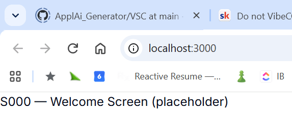

# Scaffolding this Project for VS Code, React, etc. 

* [How to Code with Kimi](../../../../../../../../../WORK/ENTITY/AI/PROVIDER/K/Kimi/How%20to%20Code%20with%20Kimi.md)

* -> **[AI Scaffolding explained](../../../../../../../../../WORK/ENTITY/AI/SETUP/Scaffolding/AI_Scaffolding.md)**

* **[scaffold.zip](scaffold.zip)**: The AI generated ZIP that unpacks into the "VSC\client\"-folder.

## What is it about?
**This SCAFFOLD-folder therefore explains what has been added to the AI generated VibCode to make it a full functional, debuggable and testable Visual Studio Code project**. 

## Summary
Vibcoding builds you the HOUSE but not its FOUNDATION.

That's why just downloading your vibecode into your IDE will (normally) not work without adding  additional configuration files into the prject's root folder such as package.json, vite.config.ts etc. which - together - will finally compile, run, debug and publish the Vibecode in your own, hands-on environment. 

The good news is, **that the set of these files can be packed by the AI in a ZIP-file (scaffold.zip) that then will be extracted into the Component's root folder** such as ..\S02_GENERATOR\VSC\client. 

Then you have to add the following Stub Components (that will then be overwritten by the AI generated code) into the  *VSC/client/SRC/features/auth/components* folder

1. **WelcomeScreen.tsx**
```typescript
export function WelcomeScreen() {
  return <div>S000 — Welcome Screen (placeholder)</div>;
}
```


2. **ProtectedRoute.tsx**
```typescript
import { ReactNode } from 'react';

interface ProtectedRouteProps {
  children: ReactNode;
}

export function ProtectedRoute({ children }: ProtectedRouteProps) {
  return <>{children}</>;
}
```

3. MainScreen.tsx
```typescript
export function MainScreen() {
  return <div>S002 — Main Screen (placeholder)</div>;
}
```

> The scaffolding is a skeleton — it has imports pointing to files the AI will generate. TypeScript checks imports at compile time, not runtime. The stubs give it something to resolve. When the AI vibecodes the real components, it will overwrite these files.

Then you just execute the following bash from within the VSC/client folder to unpack and verify the environment setup. 


1. **npm install**:  This lasts a while and will come back with warnings. 
    * Run -> ***npm audit fix --force*** to fix these issues
    * Then run  ***npm install -g npm@12.0.2***
    * Finally run ***npm fund*** to check overall consistency


2. npm run typecheck   # Should pass (0 errors)

3. npm run dev         # Opens http://localhost:3000 and displays the following screen: 

    

4. Open VSC and launch debugger with F5

```


Whereas the AI generated scaffold.zip in its standard "VSC\client\AI\KIMI\SCAFFOLD" contains all Scaffolding files (to be used as some kind of **index**), the **PURPOSE** of these files are - as always - defined in the **XCode folder**. 

So, in essence, **the scaffolding can be vibecoded as well**, but is an extra step that needs some extra care where having some sofware developer expertise might be to your advantage. 

## Prompting the Scaffolding ZIP
With KIMI the herein given [scaffold](scaffold.zip) was create with the following prompt: 

> **generate all these scaffolding files as a downloadable ZIP**

In the same session the SPEC.md and TECH.md were built. 

## Scaffolding Folders and Files
Unfortunately these files cannto be packed into a single SCAFFOLD-folder but must be mounted into given locations - many of them in the project root folder: 

| Scaffolding File       | Depends on SPEC.md?    | Changes When?                                | Stability         |
| ---------------------- | ---------------------- | -------------------------------------------- | ----------------- |
| `package.json`         | ✅ Tech stack (§1)      | New dependency added (e.g. chart lib for v2) | **Semi-stable**   |
| `vite.config.ts`       | ❌ No                   | Rarely — only if build behavior changes      | **Stable**        |
| `tsconfig.json`        | ❌ No                   | Rarely — only if module system changes       | **Stable**        |
| `tailwind.config.js`   | ✅ Design tokens (§2.2) | New colors/spacing in SPEC                   | **Semi-stable**   |
| `postcss.config.js`    | ❌ No                   | Never                                        | **Stable**        |
| `components.json`      | ❌ No                   | Never (shadcn/ui config)                     | **Stable**        |
| `index.html`           | ❌ No                   | Only if app title changes                    | **Stable**        |
| `playwright.config.ts` | ❌ No                   | Only if E2E setup changes                    | **Stable**        |
| `.vscode/*`            | ❌ No                   | Never                                        | **Stable**        |
| `src/main.tsx`         | ⚠️ Providers           | New context provider (e.g. i18n for v2)      | **Mostly stable** |
| `src/app/router.tsx`   | ✅ Routes (§4)          | New screen/route added                       | **Dynamic**       |
| `src/app/store.ts`     | ✅ Zustand slices (§8)  | New store slice added                        | **Dynamic**       |
| `src/types/index.ts`   | ✅ Data models (§5)     | New entity/interface added                   | **Dynamic**       |
| `src/styles/index.css` | ✅ Design system        | New CSS variables                            | **Semi-stable**   |
| `src/lib/utils.ts`     | ❌ No                   | Never                                        | **Stable**        |
| `src/tests/setup.ts`   | ❌ No                   | New global mock needed                       | **Mostly stable** |

which normally leads to the following structure. 
```test
VSC/client/
├── package.json          ← Template: versioned slowly
├── vite.config.ts        ← Template: versioned slowly
├── tailwind.config.js    ← Template: versioned slowly
├── src/
│   ├── main.tsx          ← Template: rarely touched
│   ├── app/
│   │   ├── router.tsx    ← Hybrid: AI adds routes, but file structure is template
│   │   └── store.ts      ← Hybrid: AI adds slices, but Zustand setup is template
│   ├── types/
│   │   └── index.ts      ← Hybrid: AI adds interfaces
│   ├── lib/
│   │   └── utils.ts      ← Template: stable
│   ├── features/
│   │   ├── auth/         ← AI generates ALL files here
│   │   └── resume/       ← AI generates ALL files here
│   └── tests/
│       └── setup.ts      ← Template: stable
```

Note here that **ALL VibeCoding is "fenced" / goes only to the src/features/ folder!** wheras all the rest is considered "scaffold stuff" or "plumbing" 

## What will CHANGE during Vibe-Coding
| Scenario                                               | File(s) Affected                         | Why                      |
| ------------------------------------------------------ | ---------------------------------------- | ------------------------ |
| AI adds a new screen (e.g. S003 Profile)               | `router.tsx`                             | New route needed         |
| AI adds a new Zustand slice (e.g. `notifications`)     | `store.ts`                               | New state domain         |
| AI adds a new entity (e.g. `JobOffer`)                 | `types/index.ts`                         | New TypeScript interface |
| AI needs a new library (e.g. `react-pdf` for v2)       | `package.json`                           | New dependency           |
| AI changes a design token (e.g. new `--warning` color) | `tailwind.config.js`, `styles/index.css` | Design system update     |

## what will NOT CHANGE during Vibe-Coding
* **vite.config.ts** — Vite is Vite. It doesn't care about your screens.
* **tsconfig.json** — TypeScript rules are static.
* **postcss.config.js** — PostCSS is a pass-through.
* **.vscode/*** — IDE settings are personal.

